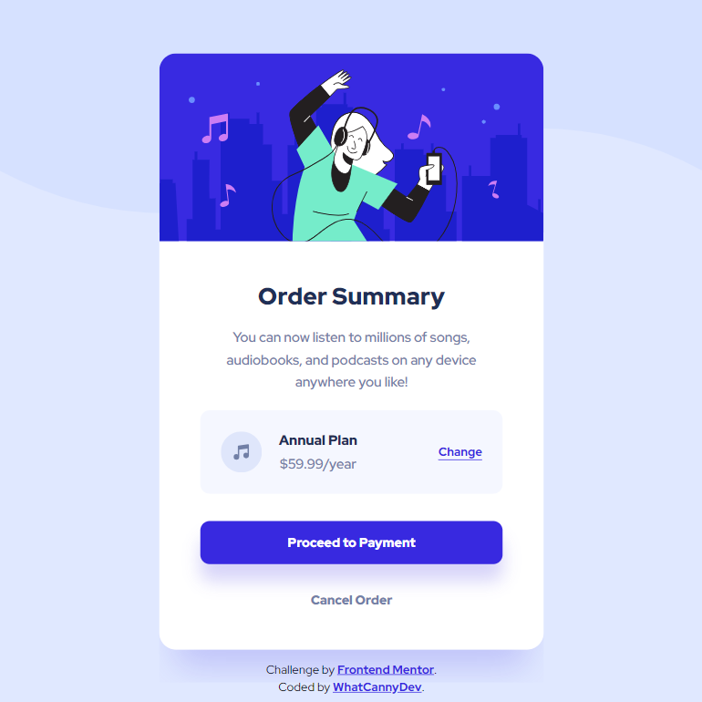

# Frontend Mentor - Order summary card solution

This is a solution to the [Order summary card challenge on Frontend Mentor](https://www.frontendmentor.io/challenges/order-summary-component-QlPmajDUj). Frontend Mentor challenges help you improve your coding skills by building realistic projects. 

## Table of contents

- [Overview](#overview)
  - [The challenge](#the-challenge)
  - [Screenshot](#screenshot)
  - [Links](#links)
- [My process](#my-process)
  - [Built with](#built-with)
  - [What I learned](#what-i-learned)
  - [Continued development](#continued-development)
- [Author](#author)

## Overview

### The challenge

Your challenge is to build out this order summary card component and get it looking as close to the design as possible.

You can use any tools you like to help you complete the challenge. So if you've got something you'd like to practice, feel free to give it a go.

Users should be able to:

- See hover states for interactive elements

### Screenshot




### Links

- Solution Repository URL: [Click here](https://github.com/CannyRo/FrontendMentor_OrderSummaryComponent_QlPmajDUj)
- Live Site URL: [Click here](https://cannyro.github.io/FrontendMentor_OrderSummaryComponent_QlPmajDUj/)

## My process

### Built with

- Semantic HTML5 markup
- CSS custom properties
- Flexbox
- Mobile-first workflow

### What I learned

The breakpoints of the css libraries are not sacred, so I can choose different breakpoints to suit the needs of my project.

Here I've used the following breakpoints: 


```css
@media (min-width: 498px){
    /* When the max-width of card is reached */
    /* 100 vw = padding left of body + max-width of .card + padding right of body*/
}
@media (min-width: 639px){ 
    /* When the 100 wv reaches the minimal width of the background size
    Minimal background size : 
    width: 639.27px;
    height: 194px;
    */
}
```

### Continued development

Continue to improve responsive management by limiting the use of fixed width and height by using min and max.

## Author

- Website - [WhatCannyDev is searching a work-study contract in France](https://cannyro.github.io/hire_mr_canny/en)
- Frontend Mentor - [@CannyRo](https://www.frontendmentor.io/profile/CannyRo)
- GitHub - [@CannyRo](https://github.com/CannyRo)
- LinkedIn - [Ronan CANNY](https://www.linkedin.com/in/ronan-canny-b29443277/)
